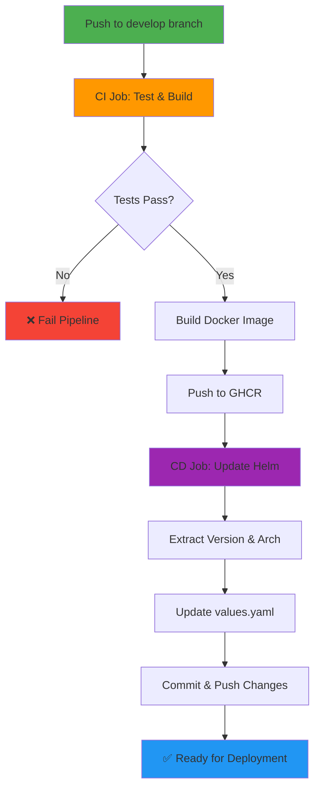

# kbot

DevOps та Kubernetes. Практичний інтенсив+

A Telegram bot application with automated CI/CD pipeline for building, testing, and deploying containerized applications to Kubernetes.

## 📋 Table of Contents

- [Overview](#overview)
- [CI/CD Workflow](#cicd-workflow)
- [Project Structure](#project-structure)
- [Getting Started](#getting-started)
- [Deployment](#deployment)

## 🔄 CI/CD Workflow

This project implements a fully automated CI/CD pipeline using GitHub Actions that builds, tests, and deploys the application.



### CI Job (Continuous Integration)

1. **Checkout code** - Fetches the repository with full git history
2. **Set up Go** - Configures Go 1.21 environment
3. **Login to GHCR** - Authenticates with GitHub Container Registry
4. **Run tests** - Executes `make test`
5. **Build image** - Builds Docker image with `make image`
6. **Push image** - Pushes to `ghcr.io/gray380/kbot:VERSION-OS-ARCH`

### CD Job (Continuous Deployment)

1. **Extract metadata** - Gets version, OS, and architecture from build
2. **Update Helm values** - Modifies `helm/values.yaml` with new image tag
3. **Commit changes** - Automatically commits and pushes updated values

## 📁 Project Structure

```
kbot/
├── .github/
│   └── workflows/
│       └── cicd.yml          # CI/CD pipeline configuration
├── helm/
│   ├── Chart.yaml            # Helm chart metadata
│   ├── values.yaml           # Default configuration values
│   └── templates/            # Kubernetes resource templates
│       ├── deployment.yaml   # Application deployment
│       ├── service.yaml      # Service definition
│       ├── ingress.yaml      # Ingress configuration
│       ├── httproute.yaml    # Gateway API HTTPRoute
│       └── hpa.yaml          # Horizontal Pod Autoscaler
├── cmd/                      # Command-line interface
├── Dockerfile                # Container image definition
├── Makefile                  # Build automation
└── README.md                 # This file
```

## 🚀 Getting Started

### Prerequisites

- Go 1.21 or higher
- Docker
- Make
- Telegram Bot Token (for running the bot)

### Building Locally

```bash
# Run tests
make test

# Build binary for your platform
make build

# Build Docker image
make image

# Push to registry (requires authentication)
make push
```

### Available Make Targets

- `make format` - Format Go code
- `make lint` - Run Go vet linter
- `make test` - Run tests
- `make build` - Build binary
- `make image` - Build Docker image
- `make push` - Push image to registry
- `make clean` - Remove build artifacts
- `make linux-amd64` - Build for Linux AMD64
- `make linux-arm64` - Build for Linux ARM64
- `make macos-amd64` - Build for macOS Intel
- `make macos-arm64` - Build for macOS Apple Silicon

## 📦 Deployment

### Using Helm

The application includes a Helm chart for easy Kubernetes deployment:

```bash
# Install the chart
helm install kbot ./helm

# Upgrade existing deployment
helm upgrade kbot ./helm

# Uninstall
helm uninstall kbot
```

### Configuration

Key configuration values in `helm/values.yaml`:

```yaml
image:
  repository: gray380/kbot
  pullPolicy: IfNotPresent
  tag: "v1.0.0"          # Updated automatically by CD pipeline
  arch: "arm64"          # Updated automatically by CD pipeline

secret:
  name: "kbot"
  env: "TELE_TOKEN"
  key: "token"
```

### Registry

Images are published to GitHub Container Registry (GHCR):

```
ghcr.io/gray380/kbot:VERSION-OS-ARCH
```

Example: `ghcr.io/gray380/kbot:v1.0.1-c1c0499-linux-amd64`

## 🔐 Secrets

The following secrets must be configured in GitHub repository settings:

- **CR_PAT** - GitHub Personal Access Token with `repo` and `packages` scopes

## 📝 License

This project is part of the DevOps and Kubernetes Practical Intensive course.
